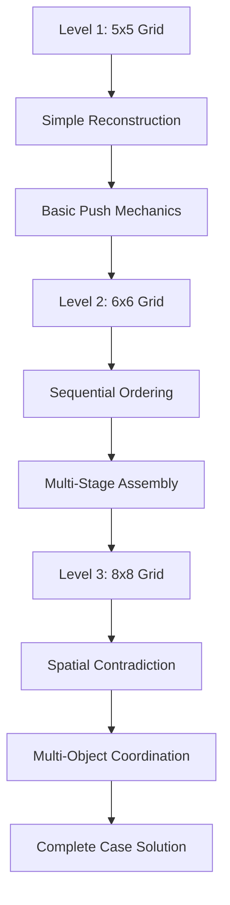

# Gameplay Integration & Technical Implementation Plan

## Progressive Difficulty & Complexity Analysis

### Level Progression Strategy


### Complexity Scaling
**Level 1 (Beginner)**:
- **Mechanics**: Basic push-to-position
- **Cognitive Load**: Pattern recognition
- **Emotional Weight**: Personal discovery
- **Time Investment**: 5-10 minutes

**Level 2 (Intermediate)**:
- **Mechanics**: Sequential ordering + decoys
- **Cognitive Load**: Reading comprehension + spatial reasoning
- **Emotional Weight**: Growing tension
- **Time Investment**: 10-15 minutes

**Level 3 (Advanced)**:
- **Mechanics**: Multi-object coordination + logic contradiction
- **Cognitive Load**: Forensic reasoning + timeline reconstruction
- **Emotional Weight**: Justice and resolution
- **Time Investment**: 15-25 minutes

## Visual Storytelling Integration

### Environmental Narrative Elements
1. **Lighting as Storytelling**:
   - Level 1: Warm, intimate lamp light (personal memories)
   - Level 2: Cold, clinical fluorescent (institutional investigation)
   - Level 3: Eerie, moonlit crime scene (haunting truth)

2. **Object Symbolism**:
   - **Photo fragments**: Broken relationships, hidden truths
   - **Letter strips**: Communication breakdown, threats
   - **Crime scene objects**: Violence, deception, staging

3. **Color Psychology**:
   - **Warm tones** → **Cool tones** → **Stark contrasts**
   - Emotional journey from nostalgia to clinical to justice

### Interactive Storytelling Mechanics
1. **Hover States**: Reveal narrative hints
2. **Placement Feedback**: Visual/audio cues for story significance
3. **Completion Animations**: Dramatic reveals tied to narrative beats
4. **Environmental Details**: Background elements that tell parallel stories

## Red Herring & Misdirection System

### Level 1 Red Herrings
- **Newspaper clipping**: Suggests Eleanor was following other cases
- **Coffee cup**: Implies she was awake late (working? worried?)
- **Pen**: Could be for writing suicide note (false lead)

### Level 2 Red Herrings
- **Wrong letter fragments**: Other relationships, mundane correspondence
- **False evidence tags**: Misdirect to other cases
- **Decoy handwriting**: Different pen types suggest multiple authors

### Level 3 Red Herrings
- **Suicide note**: Planted evidence with wrong handwriting
- **Pills bottle**: Suggests depression (false narrative)
- **Window positioning**: Implies suicide jump (actually escape route)

### Misdirection Strategy
- **Early False Confidence**: Easy solutions that feel right but are wrong
- **Narrative Doubt**: Elements that support official suicide story
- **Gradual Truth Emergence**: Red herrings become obviously false as truth emerges

## Object Interaction & Feedback Systems

### Interaction Hierarchy
1. **Primary Objects**: Essential for puzzle solution
2. **Secondary Objects**: Provide context and atmosphere
3. **Red Herring Objects**: Misdirect but add narrative depth
4. **Environmental Objects**: Immovable, set scene and mood

### Feedback Mechanisms
**Visual Feedback**:
- **Hover**: Subtle highlight, object information
- **Selection**: Clear selection state
- **Movement**: Smooth animation with physics
- **Placement**: Snap-to-grid with satisfaction

**Audio Feedback**:
- **Movement**: Appropriate material sounds (paper, wood, metal)
- **Correct Placement**: Satisfying confirmation sound
- **Wrong Placement**: Gentle rejection, not harsh
- **Completion**: Dramatic revelation audio

**Haptic Feedback** (if supported):
- **Object Contact**: Light vibration on collision
- **Correct Placement**: Stronger confirmation pulse
- **Completion**: Victory vibration pattern

## Transition Animations & Narrative Flow

### Between-Level Transitions


### Transition Types
1. **Evidence Compilation**: Show how current evidence connects to next level
2. **Location Shift**: Smooth camera movement between environments
3. **Time Progression**: Visual cues showing investigation timeline
4. **Emotional Bridge**: Music and pacing that maintains narrative tension

### Animation Specifications
- **Duration**: 2-4 seconds per transition
- **Style**: Cinematic, noir-inspired
- **Pacing**: Allows for emotional processing
- **Interactivity**: Skippable for repeat players

## Technical Implementation Specifications

### Canvas Architecture
```javascript
// Core game structure
class SokobanDetectiveGame {
  constructor() {
    this.canvas = document.getElementById('gameCanvas');
    this.ctx = this.canvas.getContext('2d');
    this.currentLevel = 1;
    this.gameState = 'narrative'; // narrative, puzzle, transition
  }
  
  // Level management
  loadLevel(levelNumber) { /* ... */ }
  
  // Puzzle mechanics
  handlePlayerInput(input) { /* ... */ }
  updateGameState() { /* ... */ }
  renderFrame() { /* ... */ }
  
  // Narrative integration
  showNarrative(text) { /* ... */ }
  playTransition(fromLevel, toLevel) { /* ... */ }
}
```

### Asset Management System
**Sprite Categories**:
- **Characters**: Detective avatar, movement animations
- **Objects**: Photo fragments, letter strips, furniture, evidence
- **Environments**: Room backgrounds, lighting effects, atmospheric details
- **UI Elements**: Buttons, text boxes, evidence compilation screens

**Asset Specifications**:
- **Resolution**: 2x scale for retina displays
- **Format**: PNG with alpha for objects, JPG for backgrounds
- **Compression**: Optimized for web delivery
- **Animation**: Sprite sheets for smooth movement

### Performance Optimization
1. **Asset Preloading**: All level assets loaded during narrative sections
2. **Canvas Optimization**: Dirty rectangle rendering for efficiency
3. **Memory Management**: Cleanup unused assets between levels
4. **Mobile Optimization**: Touch-friendly controls, responsive design

## User Interface Design

### Detective Theme Integration
**Visual Elements**:
- **Case File Aesthetic**: Manila folders, evidence tags, police tape
- **Typography**: Typewriter font for narrative, clean sans-serif for UI
- **Color Scheme**: Noir palette with evidence highlighting
- **Iconography**: Magnifying glass, evidence markers, case numbers

**Interface Components**:
1. **Evidence Tracker**: Shows collected clues from all levels
2. **Move Counter**: Tracks puzzle efficiency (optional)
3. **Hint System**: Contextual help without breaking immersion
4. **Settings Panel**: Accessibility options, audio controls

### Accessibility Features
**Visual Accessibility**:
- **High Contrast Mode**: Enhanced visibility for low vision
- **Colorblind Support**: Pattern/texture alternatives to color coding
- **Text Scaling**: Adjustable font sizes for narrative text
- **Motion Reduction**: Option to disable animations

**Motor Accessibility**:
- **Alternative Controls**: Click-and-drag, keyboard navigation
- **Timing Adjustments**: No time pressure, pausable gameplay
- **Simplified Interactions**: Reduced precision requirements

**Cognitive Accessibility**:
- **Hint System**: Progressive help without spoilers
- **Save System**: Resume progress at any point
- **Difficulty Options**: Multiple complexity levels
- **Clear Objectives**: Always-visible goals and progress

## Quality Assurance & Testing Plan

### Gameplay Testing
1. **Puzzle Solvability**: Ensure all levels have clear solutions
2. **Difficulty Curve**: Smooth progression without frustration spikes
3. **Narrative Integration**: Story beats align with gameplay moments
4. **Red Herring Balance**: Misdirection enhances rather than frustrates

### Technical Testing
1. **Cross-Browser Compatibility**: Chrome, Firefox, Safari, Edge
2. **Mobile Responsiveness**: Touch controls, screen scaling
3. **Performance Testing**: Frame rate, memory usage, loading times
4. **Accessibility Compliance**: WCAG 2.1 AA standards

### User Experience Testing
1. **First-Time Player Experience**: Intuitive without tutorials
2. **Narrative Comprehension**: Story clarity and emotional impact
3. **Replay Value**: Interesting on subsequent playthroughs
4. **Completion Satisfaction**: Rewarding conclusion to investigation

This comprehensive plan ensures that "The Cold Case of Eleanor Ash" delivers a cohesive, emotionally engaging detective experience where Sokoban mechanics serve the noir narrative rather than competing with it.